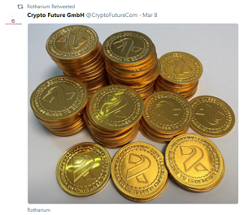
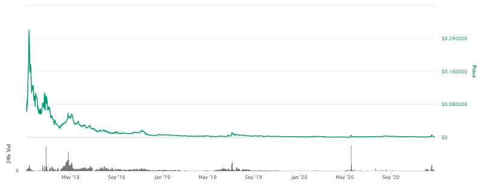
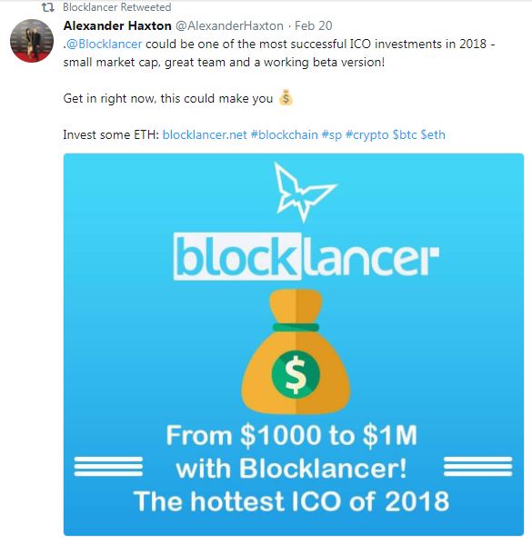
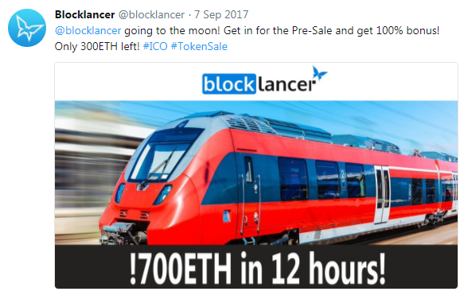
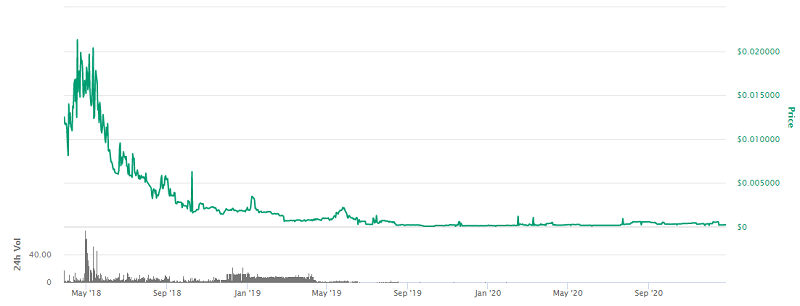
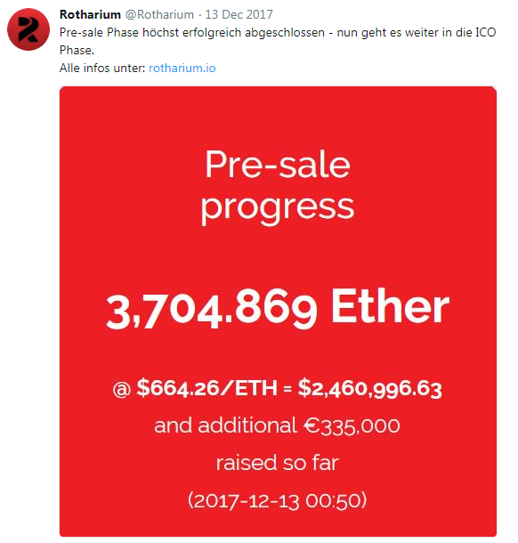
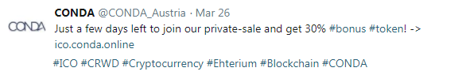
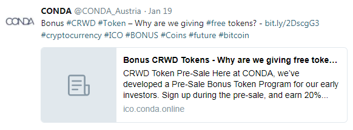
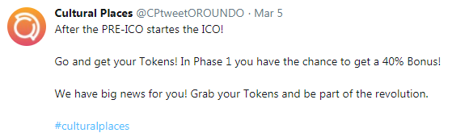

**New to Initial Coin Offerings (ICOs) / Scams? See the [Awesome Initial Coin Offerings (ICO) Truths - The Art of the Steal - The Scammers' Big Lies](https://github.com/openblockchains/awesome-ico-truths) page.**

---

PLAY • LNC •  RTH •  PAN •  CRWD •  CC

# Austrian Blockchain Token Whitepapers

The art of the steal / deal - Made in Austria   - Collection of token white papers on the blockchain

Welcome greater fools! Thanks for your money and hodling the bag!

---

**Update 2020 - (3 Years Later)**

- Hero / Herocoin (PLAY) by Byte Heroes - Price Today (Dec 2020)  -	**$0.001690 USD** (All Time High $0.324006 USD (Jan 11, 2018))  - Return on "Investment" (ROI) **-98.18%**
- Lancer (LNC) by Blocklancer   - Price Today (Dec 2020)  -	**$0.000249 USD** (All Time High $0.064559 USD (Apr 16, 2018))  - Return on "Investment" (ROI) **-97.52%**
- Rotharium (RTH) by Crypto Future   - Price Today (Dec 2020)  - **$0.497501 USD** (All Time High $9.44 USD (Nov 06, 2018)) - Return on "Investment" (ROI) **-89.22%**
- Pantos (PAN) by Bitpanda - **Ongoing Scam and Price Manipulation?**,  No Historic Price Data Found (†) 
- Crowd (CRWD) by Conda    - **Gone / Exit Scam? Thanks, for the Free Money!**,  "Traded" Anywhere? No Historic Price Data Found (†) 
- Cultural Coin (CC) by Cultural Places / Oroundo Mobile  - **Gone / Exit Scam? Thanks, for the Free Money!**,  "Traded" Anywhere? No Historic Price Data Found (†) 

(†) If you have news on the scam or historic price data, please let us know.

---

Contents

- [Intro / Background](#intro--background)
  - [What's an Initial Coin Offering (ICO) / Token Sales?](#q-whats-an-initial-coin-offering-ico--token-sales)
  - [Making 50 000% Returns on ICO "Investments" - Possible? Spoiler: No. It's bullshit / a scam.](#q-making-50-000-returns-on-ico-investments---possible-spoiler-no-its-bullshit--a-scam)
  - [How do Bitcoins differ from Austrian ICO tokens? 20-Year-Lottery vs Get-Rich-Quick-Cash-Grab-Token-Sales](#q-how-do-bitcoins-differ-from-austrian-ico-tokens-20-year-lottery-vs-get-rich-quick-cash-grab-token-sales)
- [Austrain Blockchain Tokens](#austrian-blockchain-tokens)
  - [Hero / Herocoin (PLAY) by Byte Heroes](#hero--herocoin-play-by-byte-heroes)
  - [Lancer (LNC) by Blocklancer](#lancer-lnc-by-blocklancer)
  - [Rotharium (RTH) by Crypto Future](#rotharium-rth-by-crypto-future)
  - [Pantos (PAN) by Bitpanda](#pantos-pan-by-bitpanda)
  - [Crowd (CRWD) by Conda](#crowd-crwd-by-conda)
  - [Cultural Coin (CC) by Cultural Places / Oroundo Mobile](#cultural-coin-cc-by-cultural-places--oroundo-mobile)
- [Frequently Asked Questions (F.A.Q.s) and Answers](#frequently-asked-questions-faqs-and-answers)
  - [What's a Token Sale Scam?](#q-whats-a-token-sale-scam)
  - [How can you say that these "Platform" Token Sales are Scams? Have you read the white paper? Have you seen all these serious honest businessmen, the management team and all advisors and more than dozens of happy faces in the brochure?](#q-how-can-you-say-that-these-platform-token-sales-are-scams-have-you-read-the-white-paper-have-you-seen-all-these-serious-honest-businessmen-the-management-team-and-all-advisors-and-more-than-dozens-of-happy-faces-in-the-brochure)

## Intro / Background

### Q: What's an Initial Coin Offering (ICO) / Token Sales?

Read the free excerpt titled [ICOs: Magic Beans and Bubble Machines](https://davidgerard.co.uk/blockchain/icos-magic-beans-and-bubble-machines/) from the book [Attack of the 50 Foot Blockchain](https://davidgerard.co.uk/blockchain/book/) by David Gerard.

> Token offerings have been around a while, but kicked off enormously in the second bubble. 
> The usual pretext is crowdfunding, but in practice the tokens are just traded on the exchanges as commodities. 
> The creators then cash in. The value proposition for buyers is, as for the creators, easy money in a bubble.
>
> -- David Gerard (Attack of the 50 Foot Blockchain / ICOs: Magic Beans and Bubble Machines)

### Q: Making 50 000% Returns on ICO "Investments" - Possible? Spoiler: No. It's bullshit / a scam.

Buyer beware! If it sounds too good to be true, - surprise, surprise - it is.
The Future is Bright! Free Easy Money Bullshit (BS) Example - [Early Investors are making 50 000% returns on ICOs](https://hackernoon.com/investors-are-making-50-000-returns-on-icos-32432bc741d1) by Coin and Crypto.

> Early investment is paying off big time
>
> The average return on the S&P is 10%. Over the last year bitcoin has seen unprecedented returns of 1000%. 
> But savvy cryptocurrency investors are investing in initial coin offerings (ICOs) 
> and making return on investments (ROIs) 
> as high as 50 000%. Stop and think about that for a moment. That means for a $100 investment in early 2017
> you could have netted $50 000. Not too shabby for a year of trading.
> 
> [..]
>
> The majority of startups fail, even well funded ones,
> so be prepared to lose [all] what you invest [gamble], 
> even if the landscape is optimistic. [To the moon! Thanks for your money and hodling the bag!] 

### Q: How do Bitcoins differ from Austrian ICO tokens? 20-Year-Lottery vs Get-Rich-Quick-Cash-Grab-Token-Sales

CryptoCurrency (Bitcoin Accepted Here) vs Austrian App "Platform" Tokens

Bitcoins get "mined" with every new block every ten minutes. You CANNOT buy newly minted bitcoins.
The bitcoin "lottery" gives away FREE bitcoins
to the lucky winner / number every ten minutes with every block added for the next TWENTY YEARS.

Why a lottery? A random (secure) lottery - using the famous proof-of-work hashing crypto "puzzle" -
is the fairest distribution between all network nodes / peers / players.

vs

Austrian tokens do NOT get mined. You can create / mint as many tokens as you like!
Just punch / type in a number - lets say two billion. 
Sell off 30% in an "initial coin offering" (ICO) / token sales to greater fools
in a free money get-rich-quick cash grab running for lets say two or three weeks
and keep the rest "in reserve" for yourself.

It's that easy and with the ready-to-use/ready-to-run Ethereum blockchain / network
you're off in ten minutes! 

Free easy money! Buyer beware! Do NOT get scammed by the promise of returns of 50 000% on your "investment" 
and the fear of missing out (FOMO) on the next (Austrian) bitcoin.

What Trolly McTrollface says to "ICOs are like Bitcoin / BTC":

## Austrian Blockchain Tokens

_Decentralized blockchain solution for i(nteractive video) gaming. Use $PLAY to bet on esports on our herosphere.gg website_ 

### Hero / Herocoin (PLAY) by Byte Heroes

by Byte Heroes, Praterstraße 1/3 Space 32, 1020 Vienna, Austria

Scam Alert: Medium   - **Update 2020 - (3 Years Later)** Return on Investment (ROI) in 2020:  **-98.20%  (Thanks, for the Free Money!)**, (Source: [Herocoin Price Today](https://coinmarketcap.com/currencies/herocoin/))

- Token: PLAY
- Type: Ethereum #20 / Utility
- Price in ICO: 0.0399 USD
- ICO: 14th Sep - 14th Oct 2017

> We set-up a system [free token "bounty" ICO pumping program] where our community members & investors were rewarded
> [free tokens! free tokens! free tokens!]
> for spreading the word [pumping the ICO] by sharing, posting, uploading, joining channels & commenting 
> [in Facebook, Twitter, LinkedIn, YouTube, Personal Blog, Reddit, Bitcoin Talk, ...]. 
> The most common questions here were: "Where do I have to report [to get my free tokens, free money]?", 
> "How much [free tokens, free money] do I get?", 
> "Where do I see how much I already get?" 
> and especially "when are the bounties [free tokens, free money] distributed?".
>
> Source: [Community Management during an ICO, Official Hero Coin Blog](https://medium.com/@HEROCoin/community-management-during-an-ico-3b22624c485a), October 2017

**Update 2020 - (3 Years Later)**

Hero / Herocoin (PLAY) by Byte Heroes - Price Today (Dec 2020)  -	**$0.001690 USD** (All Time High $0.324006 USD (Jan 11, 2018)) - Return on "Investment" (ROI) **-98.18%**

<!-- more -->
Source Code: [ByteHeroes @ GitHub](https://github.com/ByteHeroes)

<!--   use pics for now

> The future looks bright for [@HEROcoinio](https://twitter.com/HEROcoinio) Token price today is an absolute steal. 
> Not some BS #İCO, Redeemable #token #utility with #purpose
>
> The future home of all #eSports #eSportsbetting #Dota2 #LeagueOfLegends #CSGO
>
> -- [Johnny Ozanne @ 3 April 2018](https://twitter.com/jozanne92/status/981227870117879808) 

> $PLAY was my first ICO. They are literally going to the moon with their online betting utility token!
>
> -- [Bitcoin Player @ 19 Feb 2018](https://twitter.com/cryptoschteen/status/965629767008575488)

> In times like these, you JUST HODL IT! big times coming 🚀 watch live now @realmadriden  #esports #blockchain #onlinebetting
>
> -- [Hero @ 10 March 2018](https://twitter.com/HEROcoinio/status/972450753989238790)

> 🔥 FINALLY we can announce that HEROcoin ($PLAY) will be LISTED on @kucoincom! 🔥🔥🔝
> Thank you very much for your patience and your support! 💙
> More about #HEROcoin and #KuCoin: visit http://www.herocoin.io  and http://www.kucoin.com ! #cryptocurrency
>
> -- [Hero @ 23 Feb 2018](https://twitter.com/HEROcoinio/status/966978905876856832)

-->

---

_Distributed autonomous job market. Completely self-regulatory blockchain system for freelancers for finding jobs and getting projects done_

### Lancer (LNC) by Blocklancer 

by Blocklancer, Reichenauerstraße 84, 6020 Innsbruck, Austria

Scam Alert: High  - **Update 2020 - (3 Years Later)** Return on Investment (ROI) in 2020:  **-97.52%  (Thanks, for the Free Money!)**, (Source: [Blocklancer Price Today](https://coinmarketcap.com/currencies/blocklancer/))

- Token: LNC
- Type: Ethereum #20 / Utility
- Price in preICO: 1 ETH = 20,000 LNC
- Price in ICO: 0.0910 USD
- preICO: 7th - 21st Sep 2017
- ICO: 16th Jan - 16th Feb 2018

**Update 2020 - (3 Years Later)**

Lancer (LNC) by Blocklancer - Price Today (Dec 2020)  -	**$0.000249 USD** (All Time High $0.064559 USD (Apr 16, 2018))  - Return on "Investment" (ROI) **-97.52%**

<!-- more -->
Source Code: [BlocklancerOrg @ GitHub](https://github.com/BlocklancerOrg)

---

_The gate to the blockchain that enables you to integrate your apps into the blockchain ecosystem. Create decentralized and transparent business processes. Connect standard cloud or on-premise database solutions to the blockchain_

### Rotharium (RTH) by Crypto Future

by Crypto Future, Donau City Straße 7, 1220 Vienna, Austria

Scam Alert: High   - **Update 2020 - (3 Years Later)** Return on Investment (ROI) in 2020:  **-89.22%%  (Thanks, for the Free Money!)**, (Source: [Rotharium Price Today](https://coinmarketcap.com/currencies/rotharium/))

- Token: RTH
- Type: Ethereum #20 / Payment
- Price in ICO: 6.6017 USD
- preICO: 16th Nov - 12th Dec 2017
- ICO: 13th Dec 2017 - 14th Jan 2018

**Update 2020 - (3 Years Later)**

Rotharium (RTH) by Crypto Future - Price Today (Dec 2020)  -	**$0.497501 USD** (All Time High $9.44 USD (Nov 06, 2018)) - Return on "Investment" (ROI) **-89.22%**

---

_The (world's) first multi-blockchain token system. Made with ♥ and care in Vienna, Austria by Bitpanda_

### Pantos (PAN) by Bitpanda

by Pantos, Burggasse 116/3+3A, 1070 Vienna, Austria

Scam Alert: Medium - **Update 2020 - (3 Years Later)** Return on Investment (ROI) in 2020:  **Ongoing Scam and Price Manipulation?**,  No Historic Price Data Found (†) 

(†) If you have news on the scam or historic price data, please let us know.

Token:  PAN
Type: Ethereum #20 / Utility

Future-Proof!? For ALL Blockchains!?  -- Q: Just wondering - Can you predict the future? How many blockchains are out there now (and in the future)?

> Total supply: 1,000,000,000 PAN
>
> - 40% of PAN will be allocated among participants of the ICO.
> - The remaining 59% of PAN are reserved as a company reserve for future fundraising, management & employees and bounties. 1% of PAN will be airdropped to eligible Bitpanda users.

Note: A simple rule of thumb: If more than 50% of the coins are held in reserve (and NOT sold to the public), 
it's a redflag and you are seeing a scam by greedy bastards in action!  

**Update 2020 - (3 Years Later)**

Official Updates:

> Jul/2020: We're celebrating two years of $PAN being tradeable [on our own Bitpanda exchange].
> 
> - Buy at least €25 PAN between the 26th of July and 2nd of August  and be eligible to win 20,000 PAN. 
> - Buy the highest amount of PAN on the 26th of July, 2020 and win 50,000 PAN.

> Dec/2020:
> The Pantos project hasn't changed since its inception over 2.5 years ago,
>   [..]
>
> The Pantos community keeps asking for a timeline, 
> for plans to reward ICO-participants and a product. 
> Let it be known: we hear you, we feel you.
>
> Source: [Pantos Project Update: The way towards instant cross-blockchain communication](https://medium.com/pantos/pantos-project-update-the-way-towards-instant-cross-blockchain-communication-f43e32b7f383), December 2020

We are still researching how to break the news that your PAN tokens
are ...  yes, please, do your own researching to figure that out.

<!-- 
 sources:
https://twitter.com/PantosIO/status/1286229427899305985
https://medium.com/pantos/pantos-project-update-the-way-towards-instant-cross-blockchain-communication-f43e32b7f383
-->

---

_A fuel for building the modern financing infrastructure on the blockchain based on trust and commitment_

### Crowd (CRWD) by Conda

by Conda, Donau-City-Straße 6, 1220 Vienna, Austria

Scam Alert: Medium - **Update 2020 - (3 Years Later)** Return on Investment (ROI) in 2020:  **Gone / Exit Scam? Thanks, for the Free Money!**,  "Traded" Anywhere? No Historic Price Data Found (†) 

(†) If you have news on the scam or historic price data, please let us know.

- Token: CRWD (or CRWT?)
- Type: Ethereum #20 / Utility
- PreICO Price: CRWT = 1 EUR
- Price: CRWT = 1 EUR

> During the Private-, Pre- & Crowd-Sale, we are entitled to distribute CRWD Tokens (including Bonus Tokens)
> of up to 50 % of the total CRWD Token Number (including Bonus Tokens). If by the end of the offer period, 
> the actual number of tokens distributed by CONDA (including Bonus Tokens) is less than 50 % of the total token amount, 
> the total token amount shall be adjusted, and CONDA will burn tokens accordingly, 
> so that the number of tokens distributed by the end of the offer period (including any bonus tokens) 
> corresponds to 50 % of the then adjusted total token amount.
> CONDA will then retain any tokens that were neither distributed nor burned and shall be entitled to distribute 
> them at a later stage, if and when required or desirable by CONDA.

---

_(World's) first holistic blockchain platform that connects culture lovers, cultural institutions like museums, tourist sites and event venues with artists, a variety of content creators and donors_

### Cultural Coin (CC) by Cultural Places / Oroundo Mobile

by Oroundo Mobile, Gölsdorfgasse 4 Top 5A, 1010 Vienna, Austria

Scam Alert: High  - **Update 2020 - (3 Years Later)** Return on Investment (ROI) in 2020:  **Gone / Exit Scam? Thanks, for the Free Money!**,  "Traded" Anywhere? No Historic Price Data Found (†) 

(†) If you have news on the scam or historic price data, please let us know.

- Token: CC
- Type: Ethereum #20 / Utility
- Price in ICO: 0.0370 USD
- preICO: 26th Feb - 4th Mar 2018
- ICO: 5th Mar - 31st Dec 2018

---

## Frequently Asked Questions (F.A.Q.s) and Answers

### Q: What's a Token Sale Scam?

A: If you buy these digital tokens (on the blockchain) giving free money
as a donation / gift to a company to revolutionize 
the world one block at a time than everything is ok.

If you buy these digital token (on the blockchain) trying to get rich (quick)
by selling them at a higher price to a greater fool than - surprise, surprise - 
you're getting scammed.

Let's quote the fineprint from the "Legal FAQ" from the most serious / reputable
token sale, that is, Pantos by Bitpanda:

> Pantos - in whatever form – do NOT represent a claim on or against Bitpanda. 
> Bitpanda may decide NOT to exchange Pantos - in whatever form - at ANY time at their sole discretion. 
> [Thanks for the free money and holding the bag!] 
>
> -- Source: [Pantos Legal FAQ](https://pantos.io/pdf/pantos-ico-details.pdf)

The point is ... you own binary bits (on the blockchain) and
the value is ... excactly zero.  You say? Wait, but the token value is not (yet) excactly zero.
HODL! HODL! How much richer are you today? 

Ask yourself why should the company work hard, hard, hard to make you rich, rich, rich 
when - surprise, surprise - the company already collected all the free money from greater fools 
and  - surprise, surprise - you have zero legal claim to anything. 
Welcome to the world of business! Buyer beware! 

### Q: How can you say that these "Platform" Token Sales are Scams? Have you read the white paper? Have you seen all these serious honest businessmen, the management team and all advisors and more than dozens of happy faces in the brochure?

A: Money! Money! Money! Breaking news: Free easy money corrupts.

Breaking news: Building a "platform" to revolutionize the online betting market, tourism, token trading, ...  
you need to work, work, work hard
and - surprise, surprise - you need code monkeys (programmers).
Clicky, clicky, clicky and putting on a great dazzling marketing show is NOT good enough.

Ask these companies and happy faces where's the code, code, code?

Remember: Like secure cryptographic algorithms are by definition open - in the 21st century you can by 
definition only
build open decentralized platforms with open (source) code.

Ask these companies where are the daily check-ins, check-ins, check-ins?
Where are the daily commits, commits, commits? (†)

Remember: Running (working) code wins.

Without open (source) code for all to see the white paper promises are just dreams or
let's name it straight - big lies and cash grab scams.
Thanks for the free money and hodling the bag! 

---

(†): As an example / case study: The Bytes Heroes company sent in the [/ByteHeroes org(anization) with open source repos](https://github.com/ByteHeroes) -
"to proof" how hard they work on the new open decentralized platform. 
Surprise, surprise - the only open (source) code is the blockchain contracts to grab your money (and - of course - the contract code is just a run-of-the-mill copy used by all the other schemers).
Compare this to the humble [/OpenBlockchains education initiative](https://github.com/openblockchains) by a single random nobody funded by zero dollars ($0)
and written and coded in free time - See a difference?

---

**Disclaimer: Short version: Please think for yourself.** 

**Long version: Nothing contained on these pages is, or should be construed as providing or offering, investment, legal, accounting, tax or other advice. Do not act on any opinion expressed here without consulting a qualified professional. Note: The writers do not hold a position in any crypto tokens or cryptocurrency or blockchain company.**

---

**New to CryptoCurrencies and CryptoTokens?**

**See the [Last Week Tonight with John Oliver (HBO) Video on CryptoCurrencies](https://www.youtube.com/watch?v=g6iDZspbRMg) @ YouTube (30min).**

**Digital currencies and "platform" app tokens 
are generating a lot of get-rich-quick excitement. 
John Oliver enlists Keegan-Michael Key to get potential investors 
equally excited about the concept of caution. Buyer beware!**
