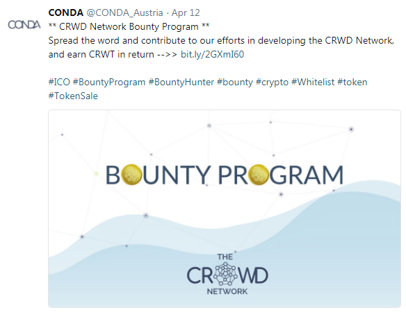

# CRWD Network - BOUNTY Program [Free Tokens! Free Tokens! Free Tokens!]

(Source: [ico.conda.online/crwd-network-bounty-program](https://ico.conda.online/crwd-network-bounty-program))

By Karin Karin Turki (Chief Marketing Officer, Conda Austria),  April 2018

Spread the word and contribute to our efforts in developing a decentralized network protocol for issuing and managing tokenized equity offerings, and earn CRWD Token in return!

## CRWD Token Distribution

CONDA will create up-to 45,000,000 CRWD Tokens wherein 3% are reserved for the entire bounty program, 
which will be distributed between:

- 20% content creation campaign
- 40% for referral campaign - coming soon
- 40% airdrop campaign - coming soon

CONDA reserves the right to change bounty campaign rules at any time - the changes will be shown on official ICO website and Bitcointalk.

## Content Creation Campaign

All participants will create content which will be scored. 
Based upon their relative participation in total score for a period of 10 days, 
they will receive bounty share equal to the relative percentage of week's award.

A bounty share is a part of the total bounty amount. Participants will get stakes on a 10-day basis during the campaign. The score for the 10 days will be reset at the beginning of every week. At the end of each week, posts are evaluated, the score is calculated and recorded. At the end of the campaign, each participants amount of bounty tokens will be calculated according to the amount of bounty stakes received.

## General Terms & Conditions

All participants must

- be whitelisted on ico.conda.online
- need to share links to their contribution in the Bounty Telegram channel to be evaluated
- the campaign starts on April 10, 2018 and ends on July 27, 2018
- new posts have to be at least 50% different than posts evaluated in the previous weeks
- NO SPAM is allowed
- restricted are: multiple accounts registrations, spam, abuse, insults

## Channels

### Facebook

- ⇒ Follow and like the official CRWD Network Facebook page

- ⇒ Fill out this form to make a request for the participation in the Facebook campaign: "CRWD Network - Facebook Bounty Sign-Up"

Facebook bounty campaign rules:

- participants have to like and follow the official CRWD Network Page
- participants need to have 200+ friends - from that 80% real friends
- the official page mentioned above has to be used for shares, tags, links etc.
- settings for posts must set to “public”
- participants must post a link to prove their activity every week in the Google Doc

SCORE=

- 0.4* No. of posts +
- 0.2 * No. of friends (1=200 - 500; 2= above 500) +
- 0.1* No. of shares (1=from 1 to 5; 2= above 5) +
- 0.3 * quality of content (1=generic content; 2=personal insight)

Check status here.

### Twitter

- ⇒ Follow and like the official CONDA account

- ⇒ Fill out this form to make a request for the participation in the Twitter campaign: "CRWD Network - Twitter Bounty Sign-Up"

Twitter bounty campaign rules:

- participants have to like and follow the official CONDA_Austria Account
- participants need to have 200+ followers - from that 80% real followers
- the official account mentioned above has to be used for retweets, tags, links etc.
- the #crwdnetwork has to be used for all activities
- participants must post a link to prove their activity every week in the Google Doc

SCORE=

- 0.4* No. of posts +
- 0.2 * No. of followers (1=200 - 500; 2= above 500) +
- 0.1* No. of retweets (1=from 1 to 5; 2= above 5) +
- 0.3 * quality of content (1=generic content; 2=personal insight)

Check status here.

### LinkedIn

- **⇒ **Follow and like the official CONDA LinkedIn profile

- ⇒ Fill out this form to make a request for the participation in the LinkedIn campaign: "CRWD Network - LinkedIn Bounty Sign-Up"

LinkedIn bounty campaign rules:

- participants have to follow the official CONDA Company Page
- participants need to have 200+ connections
- settings for posts must set to “public”
- participants must post a link to prove their activity every week in the Google Doc

SCORE=

- 0.4* No. of posts +
- 0.2 * No. of connections (1=200 - 500; 2= above 500) +
- 0.3 * quality of content (1=generic content; 2=personal insight)

Check status here.

### Reddit

- **⇒ **Fill out this form to make a request for the participation in the Reddit campaign: "CRWD Network - Reddit Bounty Campaign"

- ⇒ Participants may post original content or post official content from other social media platforms

SCORE=

- 0.4* No. of posts +
- 0.2 * No. of karma points (1=10-50; 2= above 50) +
- 0.1* No. of upvotes (1=from 1 to 50; 2= above 50) +
- 0.3 * quality of content (1=generic content; 2=personal insight)

Check status here.

### YouTube

Participants may create high quality YouTube videos about the CRWD Network - CONDA ICO (90 seconds up to 3 minutes) - starting from 50+ stakes. Additional stakes may be awarded depending on the video content quality and overall impression.

⇒ Please contact us FIRST on Telegram or per E-Mail (stojan.ivanisevic@conda.rs) and attach link to your channel.

### Personal Blog

Posting to your own blog (adds to articles) - 4 stakes
Repost non-original article about CONDA in your blog - 4 stakes

Terms and conditions:

- Article must be freely accessible
- Article must at least contain 1-2 active links to our website and social media
- Article must be original (please not just copy and paste existing articles)
- Any type of content could be rejected without any explanation

⇒ Please FIRST contact us in Telegram or per E-Mail (stojan.ivanisevic@conda.rs) and attach link to your channel.

### BitcoinTalk

- **⇒ **Fill out this form to make a request for the participation in the BitcoinTalk campaign: "CRWD Network - BitcoinTalk Bounty Sign-Up"

Terms and conditions:

- CONDA is looking for active BitcoinTalk users. All members need to post at least 10 posts containing CRWD Network - CONDA ICO relevant links inbetween the 10 days in order to be eligible for a reward.
- Users with negative trust are not eligible for the participants in the bounty campaign.
- Posts in alternate cryptocurrencies section are required. Posts in bounty (this) thread will not count.
- Spam is strictly prohibited. Users found spamming will be immediately and permanently disqualified, reported to the moderators, and banned from any other bounty campaign.
- You are not allowed to use another site's avatar.

SCORE

- Junior. Member: 1 stake / Week
- Member: 2 stakes / Week
- Full Member: 3 stakes / Week
- Sr. Member: 4 stakes / Week
- Hero Member: 6 stakes / Week
- Legendary: 8 stakes / Week
- Bonus: 1 stake per week, if participants use CONDA avatar + CONDA bounty text

CONDA avatar link.

Please set this personal text:

🌟 CONDA CRWD ICO 🌟

Terms and conditions:

- Article must be freely accessible
- Article must at least contain 1-2 active links to our website and social media
- Article must be original (please not just copy and paste existing articles)
- Any type of content could be rejected without any explanation

Check status here.
